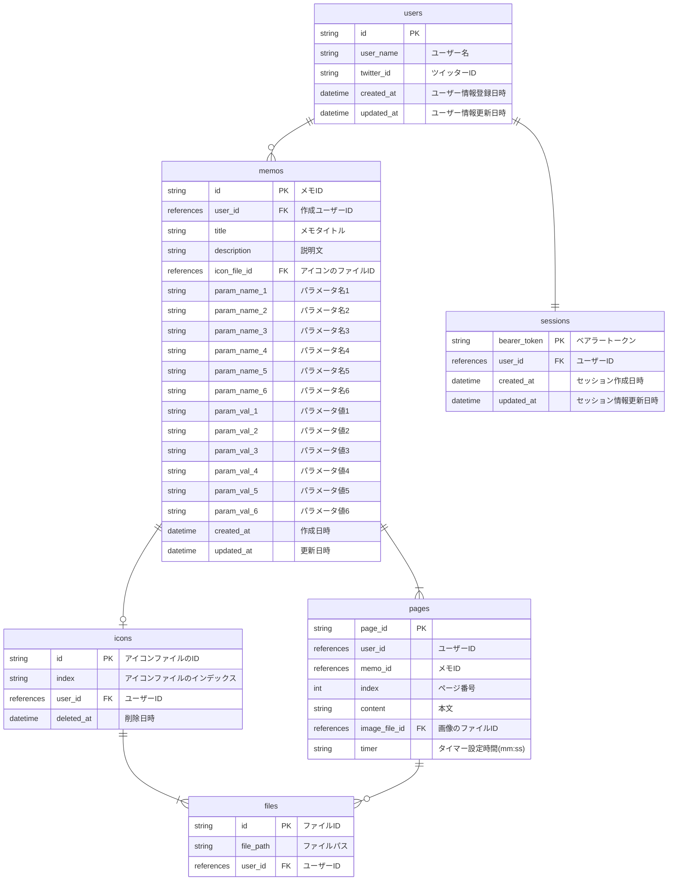

# データベース設計

```mermaid
erDiagram
  users ||--o{ memos : ""
  users ||--|| sessions : ""
  memos ||--|{ pages : ""
  memos ||--o| icons : ""
  icons ||--|{ files : ""
  pages ||--o{ files : ""

  users {
    string id PK
    string user_name "ユーザー名"
    string twitter_id "ツイッターID"
    datetime created_at "ユーザー情報登録日時"
    datetime updated_at "ユーザー情報更新日時"
  }

  sessions {
    string bearer_token PK "ベアラートークン"
    references user_id FK "ユーザーID"
    datetime created_at "セッション作成日時"
    datetime updated_at "セッション情報更新日時"
  }

  memos {
    string id PK "メモID"
    references user_id FK "作成ユーザーID"
    string title "メモタイトル"
    string description "説明文"
    references icon_file_id FK "アイコンのファイルID"
    string param_name_1 "パラメータ名1"
    string param_name_2 "パラメータ名2"
    string param_name_3 "パラメータ名3"
    string param_name_4 "パラメータ名4"
    string param_name_5 "パラメータ名5"
    string param_name_6 "パラメータ名6"
    string param_val_1 "パラメータ値1"
    string param_val_2 "パラメータ値2"
    string param_val_3 "パラメータ値3"
    string param_val_4 "パラメータ値4"
    string param_val_5 "パラメータ値5"
    string param_val_6 "パラメータ値6"
    datetime created_at　"作成日時"
    datetime updated_at　"更新日時"
  }

  pages {
    string page_id PK
    references user_id "ユーザーID"
    references memo_id "メモID"
    int index "ページ番号"
    string content "本文"
    references image_file_id FK "画像のファイルID"
    string timer "タイマー設定時間(mm:ss)"
  }

  icons {
    string id PK "アイコンファイルのID"
    string index "アイコンファイルのインデックス"
    references user_id FK "ユーザーID"
    datetime deleted_at "削除日時"
  }

  files {
    string id PK "ファイルID"
    string file_path "ファイルパス"
    references user_id FK "ユーザーID"
  }

```