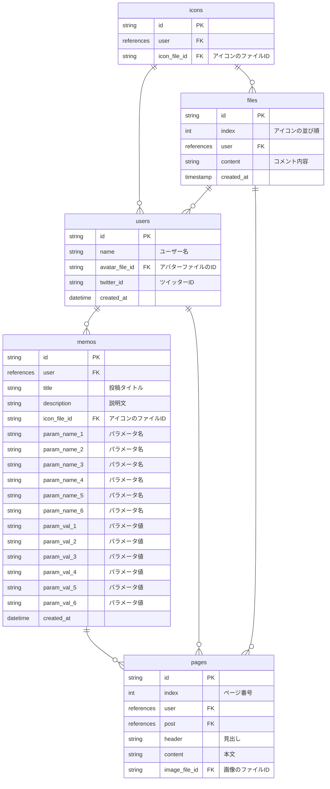

# データベース設計

```mermaid
erDiagram
  users ||--o{ memos : ""
  icons ||--o{ users : ""
  icons ||--o{ files : ""
  files ||--o{ users : ""
  memos ||--o{ pages : ""
  users ||--o{ pages : ""
  files ||--o{ pages : ""

  users {
    string id PK
    string name "ユーザー名"
    string avatar_file_id FK "アバターファイルのID"
    string twitter_id "ツイッターID"
    datetime created_at
  }

  memos {
    string id PK
    references user FK
    string title "投稿タイトル"
    string description "説明文"
    string icon_file_id FK "アイコンのファイルID"
    string param_name_1 "パラメータ名"
    string param_name_2 "パラメータ名"
    string param_name_3 "パラメータ名"
    string param_name_4 "パラメータ名"
    string param_name_5 "パラメータ名"
    string param_name_6 "パラメータ名"
    string param_val_1 "パラメータ値"
    string param_val_2 "パラメータ値"
    string param_val_3 "パラメータ値"
    string param_val_4 "パラメータ値"
    string param_val_5 "パラメータ値"
    string param_val_6 "パラメータ値"
    datetime created_at
  }

  pages {
    string id PK
    int index "ページ番号"
    references user FK
    references post FK
    string header "見出し"
    string content "本文"
    string image_file_id FK "画像のファイルID"
  }

  icons {
    string id PK
    references user FK
    string icon_file_id FK "アイコンのファイルID"
  }

  files {
    string id PK
    int index "アイコンの並び順"
    references user FK
    string content "コメント内容"
    timestamp created_at
  }

```

