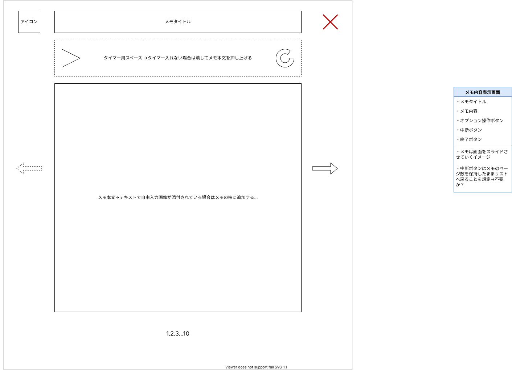
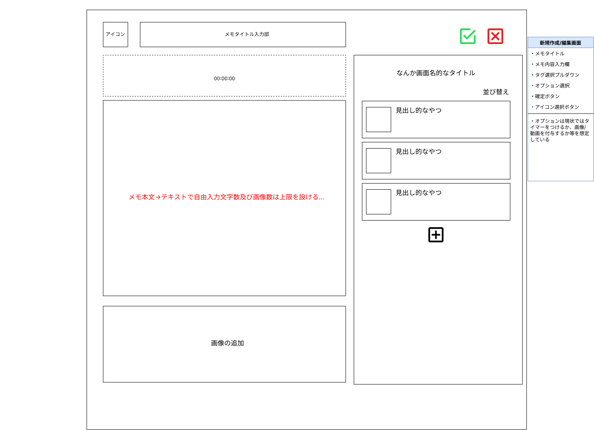
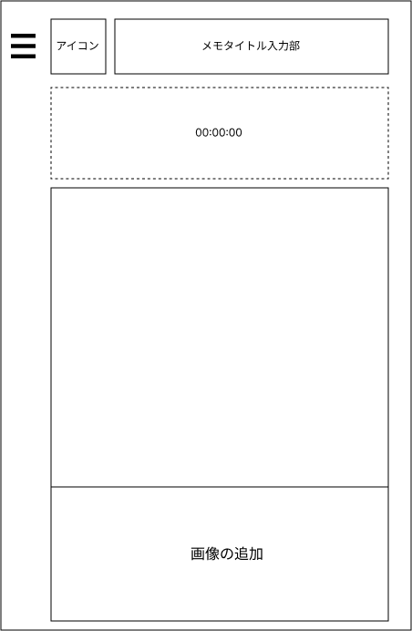
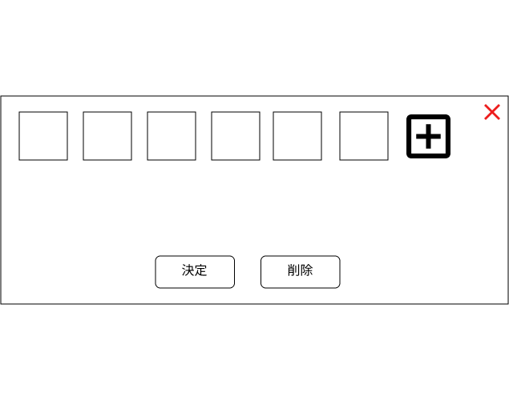

# 画面設計
- [画面設計](#画面設計)
  - [トップページ](#トップページ)
  - [マイリスト](#マイリスト)
    - [レイアウト](#レイアウト)
    - [API](#api)
    - [画面遷移](#画面遷移)
  - [ログイン画面](#ログイン画面)
    - [レイアウト](#レイアウト-1)
    - [API](#api-1)
    - [画面遷移](#画面遷移-1)
  - [リダイレクト画面](#リダイレクト画面)
    - [レイアウト](#レイアウト-2)
    - [API](#api-2)
    - [画面遷移](#画面遷移-2)
  - [メモ内容表示画面](#メモ内容表示画面)
    - [レイアウト](#レイアウト-3)
    - [API](#api-3)
    - [画面遷移](#画面遷移-3)
  - [メモ内容表新規作成/編集画面示画面](#メモ内容表新規作成編集画面示画面)
    - [レイアウト](#レイアウト-4)
    - [API](#api-4)
    - [画面遷移](#画面遷移-4)
  - [アイコン管理ダイアログ](#アイコン管理ダイアログ)
    - [API](#api-5)
    - [画面遷移](#画面遷移-5)

## トップページ

## マイリスト

### レイアウト

未ログイン時

ログイン時

### API

|メソッド|エンドポイント|備考|
|:-:|:-|:-|
|GET|/user/{user_id}/memos|ユーザーに紐づくメモ一覧の取得|
|DELETE|/memo/{memo_id}|メモの削除|

### 画面遷移
* トップページ
* 新規作成/編集画面
* メモ内容表示画面

---

## ログイン画面

### レイアウト

省略

### API

|メソッド|エンドポイント|備考|
|:-:|:-|:-|
|POST|/auth/url|Twitterの認証画面URLを取得するAPI|

### 画面遷移
* 外部サイト: Twitter認証フォーム
  * バックエンドよりAPIでURLを受け取る

## リダイレクト画面

### レイアウト

なし（リダイレクトする画面であるため、何も置かない）

### API

|メソッド|エンドポイント|備考|
|:-:|:-|:-|
|POST|/auth/token|本システムのログイン用ベアラートークンを受け取る|

### 画面遷移
* マイリスト

---

## メモ内容表示画面

### レイアウト

### API

|メソッド|エンドポイント|備考|
|:-:|:-|:-|
|GET|/memo/{memo_id}|メモの詳細を取得する|

### 画面遷移
* マイリスト

## メモ内容表新規作成/編集画面示画面

### レイアウト
PC版

スマホ版

### API

|メソッド|エンドポイント|備考|
|:-:|:-|:-|
|GET|/memo/{memo_id}|メモの詳細を取得する|
|POST|/memo|メモを作成する|
|PUT|/memo/{memo_id}|メモを更新する|

### 画面遷移
* マイリスト

## アイコン管理ダイアログ

### API

|メソッド|エンドポイント|備考|
|:-:|:-|:-|
|GET|/icons|アイコンのリストを取得する|
|POST|/icon|アイコンのリストを追加する|
|DELETE|/icon|アイコンを削除する|

### 画面遷移
なし
